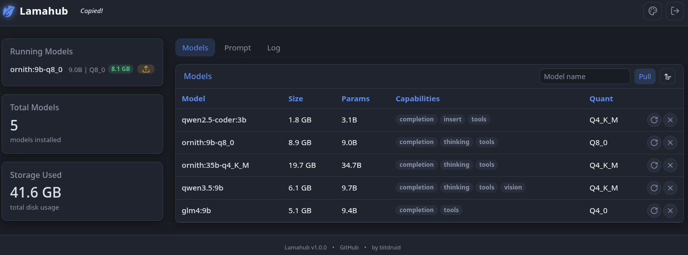

<div align="center">

#  lamahub

Mini webapp for managing Ollama LLM server models

[](https://hub.docker.com/r/bitdruid/lamahub)

<a href="example.png"></a>

</div>

# about

Lamahub is a web UI for one or more [Ollama](https://ollama.com) servers.

- view running and installed models
- pull, update and delete models
- pin models to keep them warm-loaded at a fixed context length (in the UI, or via `FIXED_MODELS`)
- browse HuggingFace GGUF models and deploy any (sharded) quant straight into Ollama (Deploy tab)
- chat / generate with any model
- switch between multiple Ollama endpoints from a dropdown
- view the application log in a dedicated tab (with level filtering)
- optional single-user login

# run

## docker

### get image
```bash
docker pull bitdruid/lamahub:latest
```
```bash
docker buildx build -t bitdruid/lamahub:latest . --load
```

### compose
```bash
docker-compose up -d
```

## script
```bash
bash start.sh [options]
```

Options:

- `-h, --host HOST` - Ollama server host (default: localhost)
- `-p, --port PORT` - Ollama server port (default: 11434)
- `-b, --base-path PATH` - Public base path when hosting under a subdirectory (example: `/subdir1/app`)
- `-u, --login-user USER` - Enable login with this username
- `-w, --login-pw PW` - Password for the login user
- `-t, --login-timeout MIN` - Session idle timeout in minutes (default: 60)
- `--help` - Show help message

## cli

Requires Python >= 3.13.

```bash
pipx install .
# or: uv tool install .
lamahub
```

Options:

- `--host HOST` - Interface to bind the UI server to (default: 0.0.0.0)
- `--port PORT` - Port for the UI server (default: 5000)
- `--ollama-url URL` - Ollama server URL(s), same format as the `OLLAMA_URL` env variable
- `--base-path PATH` - Public base path when hosting under a subdirectory (example: `/subdir1/app`)
- `--login-user USER` - Enable login with this username (requires `--login-pw`)
- `--login-pw PW` - Password for the login user (requires `--login-user`)
- `--login-timeout MIN` - Session idle timeout in minutes (default: 60)
- `--reload` - Auto-reload on code changes (development only)

## envs

Table for envs:

| Variable            | Default                        | Description                                                                                                                                                                                                                                                                                                                                                                                                   |
| ------------------- | ------------------------------ | ------------------------------------------------------------------------------------------------------------------------------------------------------------------------------------------------------------------------------------------------------------------------------------------------------------------------------------------------------------------------------------------------------------- |
| `OLLAMA_URL`        | `http://localhost:11434`       | Ollama server URL, or a comma-separated list of `Name=URL` endpoints for a dropdown switcher (example: `Dev=http://dev.ollama,Prod=http://prod.ollama`). The first entry is the default and manages `FIXED_MODELS`.                                                                                                                                                                                           |
| `BASE_PATH`         | _(empty)_                      | Public base path when hosting under a subdirectory (example: `/subdir1/app`)                                                                                                                                                                                                                                                                                                                                  |
| `FIXED_MODELS`      | _(empty)_                      | Comma-separated models pulled automatically when missing (example: `llama3.2,mistral`). Append `@<num_ctx>` to bake that context length into the model as its default — applied to every client that doesn't send its own `num_ctx`, overriding the server's `OLLAMA_CONTEXT_LENGTH`, and kept warm-loaded (example: `glm4:9b@96000`). Values above the model's native max are clamped; unpinning reverts it. |
| `HF_TOKEN`          | _(empty)_                      | Optional HuggingFace token for the Deploy tab. Raises the anonymous API/download rate limits and unlocks gated repos.                                                                                                                                                                                                                                                                                         |
| `HF_STAGING_MAX_GB` | `100`                          | Hard cap (GB) on the local shard-download cache used by the Deploy tab. When a new deploy would exceed it, least-recently-used completed families are pruned to fit (`0` = unlimited). Staged shards live under `INSTANCE_DIR`.                                                                                                                                                                               |
| `LOG_LEVEL`         | `DEBUG`                        | `DEBUG`, `INFO`, `WARNING`, `ERROR`, or `CRITICAL`. `DEBUG` includes periodic fetches; `INFO` shows only actions.                                                                                                                                                                                                                                                                                             |
| `INSTANCE_DIR`      | `instance/` inside the package | Directory for instance data like the log file                                                                                                                                                                                                                                                                                                                                                                 |
| `LOGIN`             | `false`                        | Set to `true` to require login with `LOGIN_USER` / `LOGIN_PW`. Sessions are in-memory only.                                                                                                                                                                                                                                                                                                                   |
| `LOGIN_USER`        | _(empty)_                      | Username for the login                                                                                                                                                                                                                                                                                                                                                                                        |
| `LOGIN_PW`          | _(empty)_                      | Password for the login                                                                                                                                                                                                                                                                                                                                                                                        |
| `LOGIN_TIMEOUT`     | `60`                           | Session idle timeout in minutes                                                                                                                                                                                                                                                                                                                                                                               |

## volumes

Table for volumes:

| Volume                        | Description                                                  |
| ----------------------------- | ------------------------------------------------------------ |
| `INSTANCE_DIR` (e.g. `/data`) | Instance data: Logs, pinned model stats, hf model downloads. |

---

> **Disclaimer:** fully agentic project — built entirely by AI against the [druidforms](https://github.com/creepytree/druidforms) design framework (see [AGENTS.md](AGENTS.md)).
